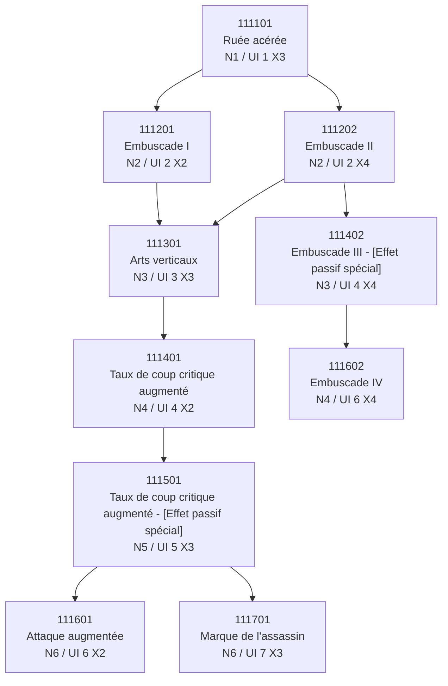
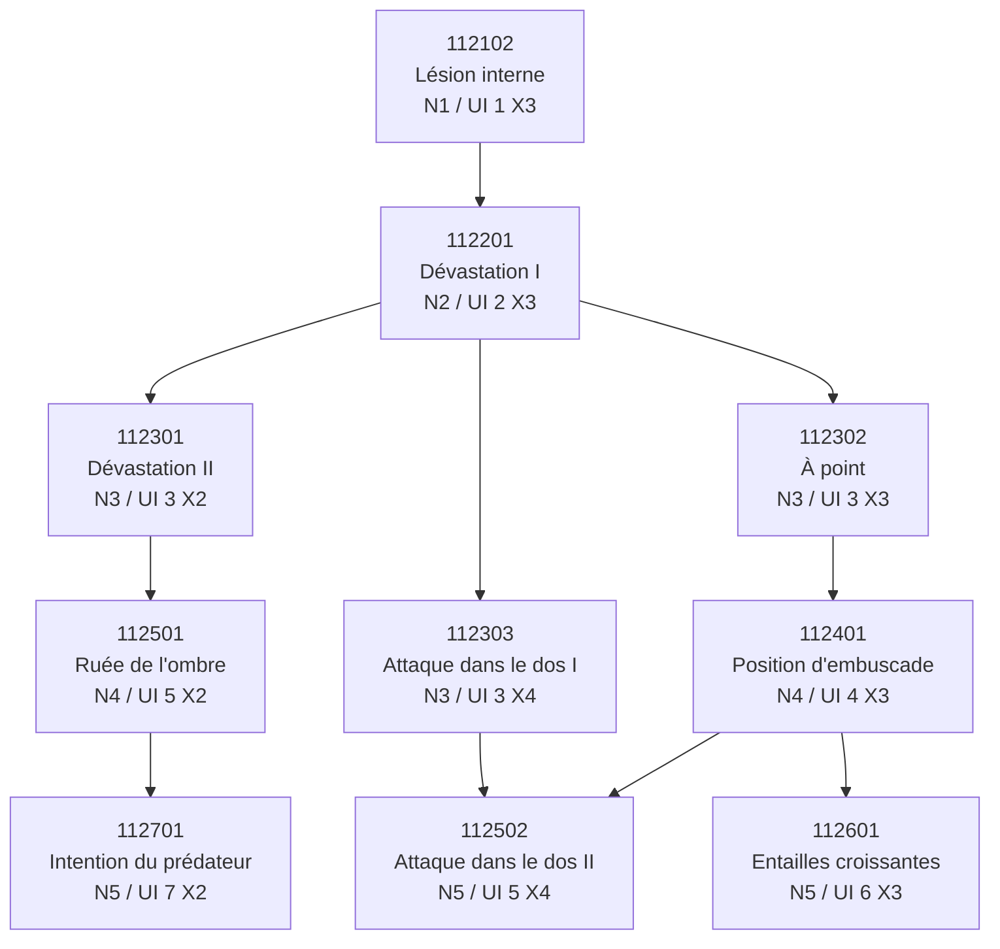

# Assassin - Graphe orienté de l'arbre de talents

Source primaire: `CharPCSkillTreeNode` pour les nœuds, parents, rangées visuelles et positions; `sjw_talent_tree.csv` pour les noms, coûts, rangs techniques, talents logiques, effets et profondeurs de progression.

Règle de reconstruction: la progression réelle vient uniquement des relations Parent/Enfant (`SlotLinkNodeID`). `NodeTierY` est conservé comme rangée visuelle (`VisualRow`) et ne crée aucune connexion.

Structure UI validée: Assassin contient deux sections de progression et un nœud central de classe / Overdrive séparé. Total: 21 nœuds.

## Sections / NodeGroups

- Nœud de classe / Overdrive: 1 nœud
- NodeGroup `1` — Attaque sournoise: 10 nœuds
- NodeGroup `2` — Frappe vitale: 10 nœuds

## Nœud de classe / Overdrive

### Contrôles du graphe

- Nombre de nœuds: 1
- Nombre d'arêtes Parent → Enfant: 0
- Nombre de racines: 1
- Nombre de feuilles: 1
- Nombre de bifurcations: 0
- Nombre de convergences: 0
- Parents référencés manquants: aucun

- Racines: 111100
- Feuilles: 111100
- Bifurcations: aucune
- Convergences: aucune

### Inventaire des nœuds

| NodeID | Talent | Profondeur de progression | Rangée visuelle | Position X/Y | Parent(s) | Enfant(s) |
|---:|---|---:|---:|---|---|---|
| 111100 | Overdrive | 0 | 1 | 4 / 1 (offset [300,-200,0]) | RACINE | FEUILLE |

### Détail par profondeur de progression

#### Niveau de progression 1

##### Overdrive

- NodeID: `111100`
- position UI: centre de classe
- effet: Passif / Overdrive
- coût: 1 IdentityPoint
- rangs: 1
- parent(s): RACINE
- débloque: aucun
- profondeur de progression: 0
- rangée visuelle / NodeTierY: 1
- position UI: X 4, Y 1, offset [300,-200,0]
- gain/rendement: Non chiffré / NON DÉTERMINÉ

## Attaque sournoise

NodeGroup: `1`

Validation contre les arêtes UI fournies: **CONFORME à la validation UI fournie**

Validation des profondeurs de progression: **CONFORME aux profondeurs attendues**

### Contrôles du graphe

- Nombre de nœuds: 10
- Nombre d'arêtes Parent → Enfant: 10
- Nombre de racines: 1
- Nombre de feuilles: 3
- Nombre de bifurcations: 3
- Nombre de convergences: 1
- Parents référencés manquants: aucun

- Racines: 111101
- Feuilles: 111601, 111602, 111701
- Bifurcations: 111101, 111202, 111501
- Convergences: 111301

### Inventaire des nœuds

| NodeID | Talent | Profondeur de progression | Rangée visuelle | Position X/Y | Parent(s) | Enfant(s) |
|---:|---|---:|---:|---|---|---|
| 111101 | Ruée acérée | 0 | 1 | 3 / 1 (offset [0,0,0]) | RACINE | 111201, 111202 |
| 111201 | Embuscade I | 1 | 2 | 2 / 2 (offset [0,0,0]) | 111101 | 111301 |
| 111202 | Embuscade II | 1 | 2 | 4 / 2 (offset [0,0,0]) | 111101 | 111301, 111402 |
| 111301 | Arts verticaux | 2 | 3 | 3 / 3 (offset [0,0,0]) | 111201, 111202 | 111401 |
| 111402 | Embuscade III - [Effet passif spécial] | 2 | 4 | 4 / 4 (offset [0,0,0]) | 111202 | 111602 |
| 111401 | Taux de coup critique augmenté | 3 | 4 | 2 / 4 (offset [0,0,0]) | 111301 | 111501 |
| 111602 | Embuscade IV | 3 | 6 | 4 / 6 (offset [0,0,0]) | 111402 | FEUILLE |
| 111501 | Taux de coup critique augmenté - [Effet passif spécial] | 4 | 5 | 3 / 5 (offset [0,0,0]) | 111401 | 111601, 111701 |
| 111601 | Attaque augmentée | 5 | 6 | 2 / 6 (offset [0,0,0]) | 111501 | FEUILLE |
| 111701 | Marque de l'assassin | 5 | 7 | 3 / 7 (offset [0,0,0]) | 111501 | FEUILLE |

### Contrôle talent logique / rang - Embuscade

Décision HUMAN: **NON FUSIONNÉ**. `Embuscade I`, `Embuscade II`, `Embuscade III` et `Embuscade IV` restent quatre nœuds/talents visuels distincts.

Preuves contrôlées:

- `NodeMaxLevel=1` pour chaque NodeID Embuscade.
- `BuffLevel=1` pour chaque BuffID direct.
- `BuffGroupID` diffère entre les BuffID directs.
- `NodeValue`, `TriggeredBuffID`, descriptions et effets déclenchés diffèrent.
- Les positions UI diffèrent: `111201` rangée 2 / X2, `111202` rangée 2 / X4, `111402` rangée 4 / X4, `111602` rangée 6 / X4.
- Le suffixe romain appartient ici au nom localisé et ne démontre pas un rang interne.

| Libellé | NodeID | NodeValue / BuffID | NodeMaxLevel | BuffGroupID | BuffLevel | Parent(s) | Enfant(s) |
|---|---:|---:|---:|---:|---:|---|---|
| Embuscade I | 111201 | 90000001 | 1 | 90000001 | 1 | 111101 | 111301 |
| Embuscade II | 111202 | 94100001 | 1 | 94100001 | 1 | 111101 | 111301, 111402 |
| Embuscade III - [Effet passif spécial] | 111402 | 90000007 | 1 | 90000007 | 1 | 111202 | 111602 |
| Embuscade IV | 111602 | 94100002 | 1 | 94100002 | 1 | 111402 | FEUILLE |

Conséquence HUMAN: les quatre talents Embuscade restent visibles séparément dans le graphe et dans les fiches. Une éventuelle famille/série `Embuscade` peut être notée plus tard, mais elle ne remplace pas la topologie.

### Vue de progression

Version Mermaid complète:



Version ASCII de lecture:

```text
111101 - Ruée acérée (bifurcation)
├── 111201 - Embuscade I
│   └── 111301 - Arts verticaux (convergence)
│       └── 111401 - Taux de coup critique augmenté
│           └── 111501 - Taux de coup critique augmenté - [Effet passif spécial] (bifurcation)
│               ├── 111601 - Attaque augmentée
│               └── 111701 - Marque de l'assassin
└── 111202 - Embuscade II (bifurcation)
    ├── 111301 - Arts verticaux (convergence) [déjà relié plus haut]
    └── 111402 - Embuscade III - [Effet passif spécial]
        └── 111602 - Embuscade IV
```

### Détail par profondeur de progression

#### Niveau de progression 1

##### Ruée acérée

- NodeID: `111101`
- position UI: centre
- effet: Compétence active
- coût: 2 SkillPoint
- rangs: 1
- parent(s): RACINE
- débloque: Embuscade I (`111201`), Embuscade II (`111202`)
- profondeur de progression: 0
- rangée visuelle / NodeTierY: 1
- position UI: X 3, Y 1, offset [0,0,0]
- gain/rendement: Non chiffré / NON DÉTERMINÉ

#### Niveau de progression 2

##### Embuscade I

- NodeID: `111201`
- position UI: gauche
- effet: Effet déclenché
- coût: 4 SkillPoint
- rangs: 1
- parent(s): Ruée acérée (`111101`)
- débloque: Arts verticaux (`111301`)
- profondeur de progression: 1
- rangée visuelle / NodeTierY: 2
- position UI: X 2, Y 2, offset [0,0,0]
- gain/rendement: Non chiffré / NON DÉTERMINÉ

##### Embuscade II

- NodeID: `111202`
- position UI: droite
- effet: Effet déclenché
- coût: 4 SkillPoint
- rangs: 1
- parent(s): Ruée acérée (`111101`)
- débloque: Arts verticaux (`111301`), Embuscade III - [Effet passif spécial] (`111402`)
- profondeur de progression: 1
- rangée visuelle / NodeTierY: 2
- position UI: X 4, Y 2, offset [0,0,0]
- gain/rendement: Non chiffré / NON DÉTERMINÉ

#### Niveau de progression 3

##### Arts verticaux

- NodeID: `111301`
- position UI: centre
- effet: Compétence active
- coût: 2 SkillPoint
- rangs: 1
- parent(s): Embuscade I (`111201`), Embuscade II (`111202`)
- débloque: Taux de coup critique augmenté (`111401`)
- profondeur de progression: 2
- rangée visuelle / NodeTierY: 3
- position UI: X 3, Y 3, offset [0,0,0]
- gain/rendement: Non chiffré / NON DÉTERMINÉ

##### Embuscade III - [Effet passif spécial]

- NodeID: `111402`
- position UI: droite
- effet: Effet déclenché
- coût: 4 SkillPoint
- rangs: 1
- parent(s): Embuscade II (`111202`)
- débloque: Embuscade IV (`111602`)
- profondeur de progression: 2
- rangée visuelle / NodeTierY: 4
- position UI: X 4, Y 4, offset [0,0,0]
- gain/rendement: Non chiffré / NON DÉTERMINÉ

#### Niveau de progression 4

##### Taux de coup critique augmenté

- NodeID: `111401`
- position UI: gauche
- effet: Effet déclenché
- coût: 4 SkillPoint
- rangs: 1
- parent(s): Arts verticaux (`111301`)
- débloque: Taux de coup critique augmenté - [Effet passif spécial] (`111501`)
- profondeur de progression: 3
- rangée visuelle / NodeTierY: 4
- position UI: X 2, Y 4, offset [0,0,0]
- gain/rendement: Non chiffré / NON DÉTERMINÉ

##### Embuscade IV

- NodeID: `111602`
- position UI: droite
- effet: Effet déclenché
- coût: 4 SkillPoint
- rangs: 1
- parent(s): Embuscade III - [Effet passif spécial] (`111402`)
- débloque: aucun
- profondeur de progression: 3
- rangée visuelle / NodeTierY: 6
- position UI: X 4, Y 6, offset [0,0,0]
- gain/rendement: Non chiffré / NON DÉTERMINÉ

#### Niveau de progression 5

##### Taux de coup critique augmenté - [Effet passif spécial]

- NodeID: `111501`
- position UI: centre
- effet: Effet déclenché
- coût: 5 SkillPoint
- rangs: 1
- parent(s): Taux de coup critique augmenté (`111401`)
- débloque: Attaque augmentée (`111601`), Marque de l'assassin (`111701`)
- profondeur de progression: 4
- rangée visuelle / NodeTierY: 5
- position UI: X 3, Y 5, offset [0,0,0]
- gain/rendement: Non chiffré / NON DÉTERMINÉ

#### Niveau de progression 6

##### Attaque augmentée

- NodeID: `111601`
- position UI: gauche
- effet: Attaque: 0.8%
- coût: 3 SkillPoint
- rangs: 1
- parent(s): Taux de coup critique augmenté - [Effet passif spécial] (`111501`)
- débloque: aucun
- profondeur de progression: 5
- rangée visuelle / NodeTierY: 6
- position UI: X 2, Y 6, offset [0,0,0]
- gain/rendement: 0.8% / NON DÉTERMINÉ

##### Marque de l'assassin

- NodeID: `111701`
- position UI: centre
- effet: Effet déclenché
- coût: 4 SkillPoint
- rangs: 1
- parent(s): Taux de coup critique augmenté - [Effet passif spécial] (`111501`)
- débloque: aucun
- profondeur de progression: 5
- rangée visuelle / NodeTierY: 7
- position UI: X 3, Y 7, offset [0,0,0]
- gain/rendement: Non chiffré / NON DÉTERMINÉ

## Frappe vitale

NodeGroup: `2`

Validation contre les arêtes UI fournies: **CONFORME à la validation UI fournie**

Validation des profondeurs de progression: **CONFORME aux profondeurs attendues**

### Contrôles du graphe

- Nombre de nœuds: 10
- Nombre d'arêtes Parent → Enfant: 10
- Nombre de racines: 1
- Nombre de feuilles: 3
- Nombre de bifurcations: 2
- Nombre de convergences: 1
- Parents référencés manquants: aucun

- Racines: 112102
- Feuilles: 112502, 112601, 112701
- Bifurcations: 112201, 112401
- Convergences: 112502

### Inventaire des nœuds

| NodeID | Talent | Profondeur de progression | Rangée visuelle | Position X/Y | Parent(s) | Enfant(s) |
|---:|---|---:|---:|---|---|---|
| 112102 | Lésion interne | 0 | 1 | 3 / 1 (offset [0,0,0]) | RACINE | 112201 |
| 112201 | Dévastation I | 1 | 2 | 3 / 2 (offset [0,0,0]) | 112102 | 112301, 112302, 112303 |
| 112301 | Dévastation II | 2 | 3 | 2 / 3 (offset [0,0,0]) | 112201 | 112501 |
| 112302 | À point | 2 | 3 | 3 / 3 (offset [0,0,0]) | 112201 | 112401 |
| 112303 | Attaque dans le dos I | 2 | 3 | 4 / 3 (offset [0,0,0]) | 112201 | 112502 |
| 112401 | Position d'embuscade | 3 | 4 | 3 / 4 (offset [0,0,0]) | 112302 | 112502, 112601 |
| 112501 | Ruée de l'ombre | 3 | 5 | 2 / 5 (offset [0,0,0]) | 112301 | 112701 |
| 112502 | Attaque dans le dos II | 4 | 5 | 4 / 5 (offset [0,0,0]) | 112401, 112303 | FEUILLE |
| 112601 | Entailles croissantes | 4 | 6 | 3 / 6 (offset [0,0,0]) | 112401 | FEUILLE |
| 112701 | Intention du prédateur | 4 | 7 | 2 / 7 (offset [0,0,0]) | 112501 | FEUILLE |

### Vue de progression

Version Mermaid complète:



Version ASCII de lecture:

```text
112102 - Lésion interne
└── 112201 - Dévastation I (bifurcation)
    ├── 112301 - Dévastation II
    │   └── 112501 - Ruée de l'ombre
    │       └── 112701 - Intention du prédateur
    ├── 112302 - À point
    │   └── 112401 - Position d'embuscade (bifurcation)
    │       ├── 112502 - Attaque dans le dos II (convergence)
    │       └── 112601 - Entailles croissantes
    └── 112303 - Attaque dans le dos I
        └── 112502 - Attaque dans le dos II (convergence) [déjà relié plus haut]
```

### Détail par profondeur de progression

#### Niveau de progression 1

##### Lésion interne

- NodeID: `112102`
- position UI: centre
- effet: Compétence active
- coût: 2 SkillPoint
- rangs: 1
- parent(s): RACINE
- débloque: Dévastation I (`112201`)
- profondeur de progression: 0
- rangée visuelle / NodeTierY: 1
- position UI: X 3, Y 1, offset [0,0,0]
- gain/rendement: Non chiffré / NON DÉTERMINÉ

#### Niveau de progression 2

##### Dévastation I

- NodeID: `112201`
- position UI: centre
- effet: Effet déclenché
- coût: 4 SkillPoint
- rangs: 1
- parent(s): Lésion interne (`112102`)
- débloque: Dévastation II (`112301`), À point (`112302`), Attaque dans le dos I (`112303`)
- profondeur de progression: 1
- rangée visuelle / NodeTierY: 2
- position UI: X 3, Y 2, offset [0,0,0]
- gain/rendement: Non chiffré / NON DÉTERMINÉ

#### Niveau de progression 3

##### Dévastation II

- NodeID: `112301`
- position UI: gauche
- effet: Effet déclenché
- coût: 4 SkillPoint
- rangs: 1
- parent(s): Dévastation I (`112201`)
- débloque: Ruée de l'ombre (`112501`)
- profondeur de progression: 2
- rangée visuelle / NodeTierY: 3
- position UI: X 2, Y 3, offset [0,0,0]
- gain/rendement: Non chiffré / NON DÉTERMINÉ

##### À point

- NodeID: `112302`
- position UI: centre
- effet: Compétence active
- coût: 2 SkillPoint
- rangs: 1
- parent(s): Dévastation I (`112201`)
- débloque: Position d'embuscade (`112401`)
- profondeur de progression: 2
- rangée visuelle / NodeTierY: 3
- position UI: X 3, Y 3, offset [0,0,0]
- gain/rendement: Non chiffré / NON DÉTERMINÉ

##### Attaque dans le dos I

- NodeID: `112303`
- position UI: droite
- effet: Effet déclenché
- coût: 4 SkillPoint
- rangs: 1
- parent(s): Dévastation I (`112201`)
- débloque: Attaque dans le dos II (`112502`)
- profondeur de progression: 2
- rangée visuelle / NodeTierY: 3
- position UI: X 4, Y 3, offset [0,0,0]
- gain/rendement: Non chiffré / NON DÉTERMINÉ

#### Niveau de progression 4

##### Position d'embuscade

- NodeID: `112401`
- position UI: centre
- effet: Effet déclenché
- coût: 4 SkillPoint
- rangs: 1
- parent(s): À point (`112302`)
- débloque: Attaque dans le dos II (`112502`), Entailles croissantes (`112601`)
- profondeur de progression: 3
- rangée visuelle / NodeTierY: 4
- position UI: X 3, Y 4, offset [0,0,0]
- gain/rendement: Non chiffré / NON DÉTERMINÉ

##### Ruée de l'ombre

- NodeID: `112501`
- position UI: gauche
- effet: Effet déclenché
- coût: 4 SkillPoint
- rangs: 1
- parent(s): Dévastation II (`112301`)
- débloque: Intention du prédateur (`112701`)
- profondeur de progression: 3
- rangée visuelle / NodeTierY: 5
- position UI: X 2, Y 5, offset [0,0,0]
- gain/rendement: Non chiffré / NON DÉTERMINÉ

#### Niveau de progression 5

##### Attaque dans le dos II

- NodeID: `112502`
- position UI: droite
- effet: Dégâts dans le dos: 320
- coût: 5 SkillPoint
- rangs: 1
- parent(s): Position d'embuscade (`112401`), Attaque dans le dos I (`112303`)
- débloque: aucun
- profondeur de progression: 4
- rangée visuelle / NodeTierY: 5
- position UI: X 4, Y 5, offset [0,0,0]
- gain/rendement: Non chiffré / NON DÉTERMINÉ

##### Entailles croissantes

- NodeID: `112601`
- position UI: centre
- effet: Compétence active
- coût: 2 SkillPoint
- rangs: 1
- parent(s): Position d'embuscade (`112401`)
- débloque: aucun
- profondeur de progression: 4
- rangée visuelle / NodeTierY: 6
- position UI: X 3, Y 6, offset [0,0,0]
- gain/rendement: Non chiffré / NON DÉTERMINÉ

##### Intention du prédateur

- NodeID: `112701`
- position UI: gauche
- effet: Effet déclenché
- coût: 4 SkillPoint
- rangs: 1
- parent(s): Ruée de l'ombre (`112501`)
- débloque: aucun
- profondeur de progression: 4
- rangée visuelle / NodeTierY: 7
- position UI: X 2, Y 7, offset [0,0,0]
- gain/rendement: Non chiffré / NON DÉTERMINÉ

